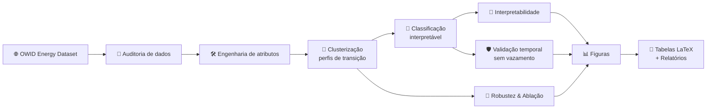
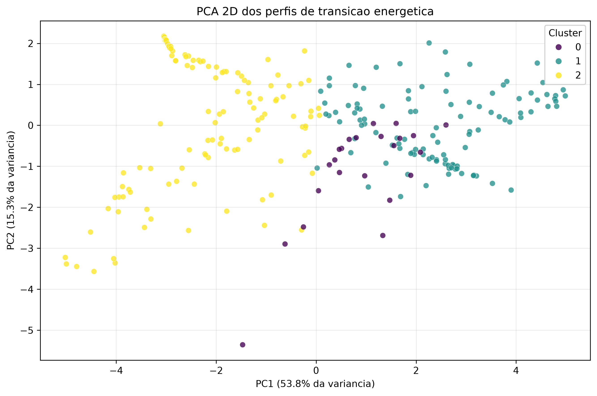
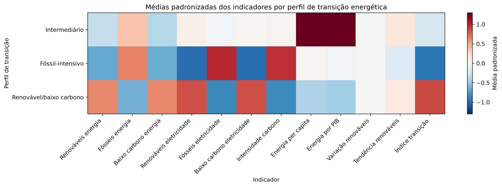
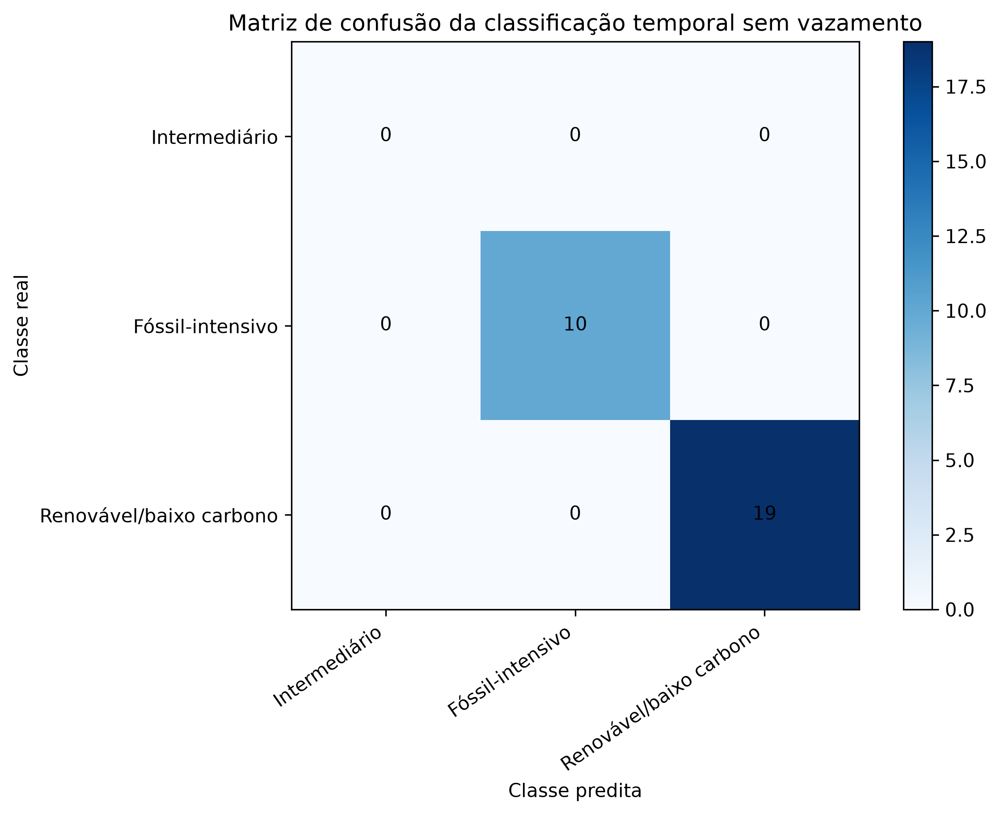
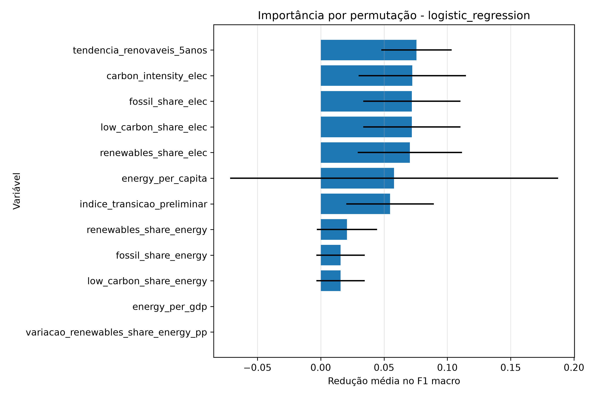

<div align="center">

# 🌎⚡ MERCOSUL · Descarbonização & Transição Energética com Machine Learning

### Mineração de dados e aprendizado de máquina interpretável para classificação de trajetórias de descarbonização nos países do MERCOSUL e associados

*Estudo experimental submetido ao **Prêmio MERCOSUL de Ciência e Tecnologia 2026** — eixo "Descarbonização e Transição Energética para um Mundo mais Sustentável".*

<br>


</div>

---

> [!NOTE]
> **Em uma frase:** o projeto usa dados públicos de energia para descobrir, de forma automática, **quais países do MERCOSUL estão mais ou menos avançados na transição energética** — e faz isso com um método transparente, auditável e reprodutível, pensado para sustentar um artigo científico.

---

## 📑 Índice

- [🎯 O que este projeto faz](#-o-que-este-projeto-faz)
- [💡 A pergunta de pesquisa](#-a-pergunta-de-pesquisa)
- [🗺️ Países analisados](#️-países-analisados)
- [🧠 Como funciona (visão geral)](#-como-funciona-visão-geral)
- [🔬 O pipeline passo a passo](#-o-pipeline-passo-a-passo)
- [📊 Principais resultados](#-principais-resultados)
- [🗂️ Estrutura de pastas](#️-estrutura-de-pastas)
- [⚙️ Instalação e execução](#️-instalação-e-execução)
- [📁 O que o pipeline gera](#-o-que-o-pipeline-gera)
- [🛡️ Rigor metodológico](#️-rigor-metodológico)
- [⚠️ Limitações conhecidas](#️-limitações-conhecidas)
- [🚀 Próximos passos](#-próximos-passos)
- [📚 Fonte de dados e créditos](#-fonte-de-dados-e-créditos)

---

## 🎯 O que este projeto faz

A transição energética é um processo desigual: alguns países já geram boa parte da sua energia a partir de fontes renováveis, enquanto outros ainda dependem fortemente de combustíveis fósseis. Este projeto trata essa diferença como um **problema de dados**.

Partindo de indicadores públicos de energia, emissões e desenvolvimento socioeconômico, o estudo:

1. 🧹 **Audita e organiza** os dados (cobertura por país, valores ausentes, qualidade das variáveis);
2. 🛠️ **Cria atributos** que descrevem a transição (ex.: tendência de renováveis em 5 anos, índice preliminar de transição);
3. 🧩 **Agrupa (clusteriza)** observações país-ano em **perfis de transição energética** sem usar rótulos pré-definidos;
4. 🤖 **Treina um classificador interpretável** que aprende a reproduzir esses perfis;
5. 🔎 **Interpreta** quais variáveis mais explicam cada perfil;
6. ✅ **Valida sem vazamento temporal** e testa **robustez** e **ablação** de variáveis;
7. 📄 **Exporta tabelas e figuras** prontas para o artigo (LaTeX/Overleaf).

O resultado é um retrato, baseado em evidência, de **como os países da região se agrupam segundo o estágio de sua transição energética**.

---

## 💡 A pergunta de pesquisa

> **É possível, usando apenas indicadores públicos, identificar perfis de transição energética consistentes, interpretáveis e metodologicamente defensáveis para os países do MERCOSUL e associados?**

O estudo combina **aprendizado não supervisionado** (para descobrir os perfis) com **aprendizado supervisionado interpretável** (para confirmar que esses perfis são estatisticamente separáveis e entender o que os define).

---

## 🗺️ Países analisados

| 🇦🇷 Argentina | 🇧🇴 Bolívia | 🇧🇷 Brasil | 🇨🇱 Chile | 🇨🇴 Colômbia |
|:---:|:---:|:---:|:---:|:---:|
| 🇪🇨 **Equador** | 🇵🇾 **Paraguai** | 🇵🇪 **Peru** | 🇺🇾 **Uruguai** | 🇻🇪 **Venezuela** |

**10 países** · cobertura histórica de **1900 a 2025** · base processada com **1.099 observações** país-ano · subconjunto modelável (a partir de 2000, com indicadores completos): **259 observações**.

---

## 🧠 Como funciona (visão geral)



O fluxo separa claramente **o que é descoberto pelos dados** (clusters) **do que é confirmado por modelo** (classificação), garantindo que nenhuma conclusão seja apresentada sem lastro nos resultados.

---

## 🔬 O pipeline passo a passo

Cada etapa é um script numerado em `scripts/`, executável de ponta a ponta por um orquestrador único.

| # | Script | O que faz |
|:--:|:---|:---|
| 01 | `01_coleta_dados.py` | Baixa e registra metadados da base OWID |
| 02 | `02_auditoria_dados.py` | Cobertura por país, valores ausentes, variáveis candidatas |
| 03 | `03_engenharia_atributos.py` | Cria os atributos de transição energética |
| 04 | `04_clusterizacao_perfis.py` | Clusteriza perfis (KMeans, Agglomerative, GMM) |
| 05 | `05_classificacao_ml.py` | Classificação supervisionada dos perfis |
| 06 | `06_interpretabilidade.py` | Importância de variáveis por permutação |
| 08 | `08_validacao_temporal_sem_vazamento.py` | Validação temporal sem *data leakage* |
| 09 | `09_robustez_clusterizacao.py` | Estabilidade dos clusters (seeds, k, algoritmos) |
| 10 | `10_interpretacao_perfis_clusters.py` | Nomeia e interpreta os perfis |
| 11 | `11_visualizacoes_resultados.py` | Gera as figuras científicas |
| 12 | `12_estudo_ablacao_variaveis.py` | Estudo de ablação de variáveis |
| 13 | `13_exportar_tabelas_latex.py` | Exporta tabelas `.tex` para o artigo |
| 07 | `07_relatorio_resultados.py` | Consolida o relatório final de resultados |

▶️ Rodar tudo: `python scripts/00_executar_pipeline_completo.py`

---

## 📊 Principais resultados

> [!IMPORTANT]
> Os resultados abaixo descrevem **perfis derivados dos próprios dados**. Eles indicam **separabilidade e padrões regionais**, não constituem prova causal de descarbonização. Veja [Limitações](#️-limitações-conhecidas).

### 🧩 Três perfis de transição energética

A clusterização (KMeans, *k* = 3) produziu a melhor configuração inicial com **silhouette = 0,367**, **Davies-Bouldin = 1,038** e **Calinski-Harabasz = 129,9**, organizando as observações em três perfis interpretáveis:

| Perfil | Observações | Países | Característica central |
|:---|:--:|:--:|:---|
| 🟢 **Renovável / baixo carbono** | 127 | 8 | Alta participação de renováveis e baixo carbono; baixa intensidade de carbono |
| 🔴 **Fóssil-intensivo** | 109 | 7 | Predominância fóssil na matriz e na eletricidade; maior intensidade de carbono |
| 🟡 **Intermediário** | 23 | 1 | Sinais mistos — restrito à trajetória da Venezuela (2000–2022); tratar com cautela |

#### 🗺️ Onde cada país estava no ano mais recente disponível

| Perfil | Países (ano mais recente) |
|:---|:---|
| 🟢 Renovável / baixo carbono | 🇧🇷 Brasil · 🇨🇱 Chile · 🇨🇴 Colômbia · 🇪🇨 Equador · 🇵🇾 Paraguai · 🇺🇾 Uruguai · 🇻🇪 Venezuela |
| 🔴 Fóssil-intensivo | 🇦🇷 Argentina · 🇧🇴 Bolívia · 🇵🇪 Peru |

### 🔵 Visualização dos perfis (PCA 2D)

Projeção em dois componentes principais (que retêm **53,8%** + **15,3%** da variância). A separação visual confirma que os perfis ocupam regiões distintas do espaço de atributos.

<div align="center">
  
</div>

### 🌡️ Assinatura de cada perfil (centroides padronizados)

O *heatmap* mostra, para cada perfil, o quanto cada indicador está acima (vermelho) ou abaixo (azul) da média geral — é a "impressão digital" de cada trajetória.

<div align="center">
  
</div>

### 🤖 Classificação interpretável (validação temporal sem vazamento)

Um classificador foi treinado para **reproduzir** os perfis usando apenas dados até **2022** e testado em **2023–2025** (230 amostras de treino / 29 de teste). A **Regressão Logística** atingiu desempenho máximo:

| Modelo | Acurácia | Acur. balanceada | F1 macro |
|:---|:--:|:--:|:--:|
| 🥇 **Regressão Logística** | **1,000** | **1,000** | **1,000** |
| KNN | 0,966 | 0,974 | 0,963 |
| SVM (RBF) | 0,966 | 0,974 | 0,963 |
| Random Forest | 0,966 | 0,974 | 0,963 |
| Árvore de Decisão | 0,724 | 0,766 | 0,550 |

<div align="center">
  
</div>

> [!WARNING]
> O perfil **Intermediário** não aparece no conjunto de teste temporal (linha/coluna zerada). Isso é uma **limitação da amostra**, não a ausência do perfil. O desempenho perfeito reflete a **boa separabilidade dos perfis derivados** — não uma previsão de classe externa real.

### 🔎 Variáveis mais relevantes

A importância por permutação aponta como mais informativas: **tendência de renováveis (5 anos)**, **intensidade de carbono da eletricidade**, **participação fóssil/baixo carbono na eletricidade** e o **índice preliminar de transição**.

<div align="center">
  
</div>

### 🧪 O que o estudo de ablação revelou

Removendo grupos de variáveis e remedindo o desempenho:

| Cenário | Variáveis | Acurácia (melhor modelo) |
|:---|:--:|:--:|
| A — Todas as variáveis | 12 | 1,000 |
| B — Sem índice de transição | 11 | 1,000 |
| E — Sem variáveis derivadas | 9 | 0,966 |
| D — Apenas eletricidade | 4 | ~0,862 |
| C — Apenas energia | 6 | ~0,517 |

➡️ As variáveis de **eletricidade** carregam grande parte do sinal; usar **apenas** indicadores de energia primária degrada fortemente o desempenho. Isso reforça o papel da matriz elétrica na caracterização da transição.

---

## 🗂️ Estrutura de pastas

```text
mercosul-descarbonizacao-ml/
├── 📂 data/
│   ├── raw/                 # Dados originais (OWID)
│   ├── processed/           # Bases tratadas e modeláveis
│   └── external/            # Bases complementares futuras
├── 📂 scripts/              # Pipeline experimental numerado (00–13)
├── 📂 utils/                # Funções utilitárias e configuração
├── 📂 notebooks/            # Análises exploratórias opcionais
├── 📂 results/              # ⭐ TODOS os resultados ficam aqui
│   ├── tables/              # Tabelas .csv geradas
│   ├── latex/               # Tabelas .tex (Overleaf)
│   ├── figures/             # Figuras .png científicas
│   ├── models/              # Modelos salvos
│   └── reports/             # Relatórios em Markdown
├── 📂 article/              # Artigo em LaTeX + figuras do artigo
├── 📂 references/           # Referências e notas bibliográficas
└── 📂 _backups/             # Backups locais antes de alterações
```

> [!TIP]
> **Toda saída do projeto vive em `results/`.** As tabelas (`results/tables/`), figuras (`results/figures/`), tabelas LaTeX (`results/latex/`) e relatórios (`results/reports/`) são a fonte única de verdade. Qualquer cópia gerada na raiz por execuções antigas é descartável.

---

## ⚙️ Instalação e execução

Pré-requisito: **Python 3.10+** (testado em 3.13).

```powershell
# 1) Ambiente virtual
python -m venv .venv
.\.venv\Scripts\Activate.ps1

# 2) Dependências
python -m pip install --upgrade pip
pip install -r requirements.txt

# 3) (Opcional) Modelos e interpretabilidade avançados
pip install -r requirements-optional.txt

# 4) Rodar o pipeline completo
python scripts\00_executar_pipeline_completo.py
```

> [!NOTE]
> O código foi escrito para **continuar funcionando mesmo sem** `xgboost`, `lightgbm`, `umap-learn` ou `shap`. Essas dependências são opcionais.

### 🧹 Organizar a raiz (opcional)

Execuções antigas podem ter deixado cópias de tabelas/figuras na raiz do projeto. Para mantê-las apenas em `results/`, rode:

```powershell
.\organizar_resultados.ps1
```

O script move (não apaga) as duplicatas da raiz para `_backups/`, conferindo antes que cada arquivo já exista em `results/`.

---

## 📁 O que o pipeline gera

<details>
<summary><b>📈 Tabelas principais (results/tables/)</b></summary>

- `metricas_clusterizacao.csv`, `perfis_clusters.csv`, `perfis_clusters_interpretados.csv`
- `metricas_classificacao.csv`, `importancia_permutacao.csv`, `matriz_confusao_melhor_modelo.csv`
- `metricas_classificacao_sem_vazamento.csv`, `comparacao_modelos_com_sem_vazamento.csv`
- `robustez_clusterizacao.csv`, `estabilidade_clusters_ari.csv`
- `ablacao_variaveis_classificacao.csv`, `ablacao_variaveis_clusterizacao.csv`
- `nomes_clusters_sugeridos.csv`, `paises_por_cluster_ano_recente.csv`

</details>

<details>
<summary><b>🖼️ Figuras (results/figures/)</b></summary>

- `pca_clusters.png` — PCA 2D dos perfis
- `heatmap_centroides_artigo.png` — assinatura padronizada dos perfis
- `heatmap_clusters_pais_ano.png` — perfil por país e ano
- `matriz_confusao_artigo.png` — matriz de confusão (sem vazamento)
- `importancia_permutacao_top15.png` — variáveis mais relevantes
- `evolucao_renovaveis_paises_chave.png`, `evolucao_intensidade_carbono_paises_chave.png`

</details>

<details>
<summary><b>📄 Tabelas LaTeX (results/latex/) e Relatórios (results/reports/)</b></summary>

**LaTeX (prontas para Overleaf):** `tabela_cobertura_paises.tex`, `tabela_metricas_clusterizacao.tex`, `tabela_metricas_classificacao.tex`, `tabela_importancia_variaveis.tex`, `tabela_perfis_clusters.tex`, `tabela_validacao_sem_vazamento.tex`, `tabela_robustez_clusterizacao.tex`

**Relatórios:** `relatorio_viabilidade.md`, `relatorio_resultados_completo.md`

</details>

---

## 🛡️ Rigor metodológico

Este estudo foi desenhado para resistir à crítica científica:

- **Sem vazamento temporal** 🔒 — na validação sem *leakage*, o imputador, o *scaler* e o KMeans são ajustados **somente no treino até 2022**; os anos de 2023 em diante são atribuídos ao centroide treinado mais próximo.
- **Rótulos honestos** 🏷️ — os rótulos da classificação são **derivados da clusterização**. Por isso descrevemos a classificação como *"o modelo aprende a reproduzir perfis identificados de forma não supervisionada"*, e não como previsão de uma classe externa real.
- **Robustez** 🔁 — os clusters foram reavaliados variando algoritmo (KMeans, Agglomerative, GMM), número de grupos (*k* = 2 a 6) e múltiplas *seeds*.
- **Ablação** 🧪 — quantifica a contribuição de cada grupo de variáveis e o efeito do índice composto de transição.
- **Reprodutibilidade** ♻️ — pipeline numerado, *seeds* fixas e exportação automática de tabelas e figuras.

---

## ⚠️ Limitações conhecidas

- Os rótulos supervisionados são **derivados** da clusterização — não são classes externas observadas.
- Desempenho de classificação alto indica **separabilidade dos perfis derivados**, não prova causal de descarbonização.
- A base OWID pode ser **revisada** ao longo do tempo, alterando levemente valores e métricas.
- Há **lacunas históricas** e diferenças de cobertura entre variáveis e países (sobretudo anos mais antigos; Paraguai e Uruguai a partir de 1980).
- O **índice preliminar de transição** é uma variável composta; seus efeitos devem ser lidos junto à ablação.
- O perfil **Intermediário** está associado a um único país (Venezuela) e pode refletir uma trajetória nacional específica, não um padrão regional amplo.

---

## 🚀 Próximos passos

- [ ] Selecionar as figuras finais para o artigo.
- [ ] Priorizar os resultados **sem vazamento** na narrativa metodológica.
- [ ] Validar os nomes dos perfis com a literatura de energia regional.
- [ ] Relacionar trajetórias nacionais recentes a eventos de política energética e contexto econômico.
- [ ] Finalizar tabelas em LaTeX a partir de `results/latex/`.

---

## 📚 Fonte de dados e créditos

- **Dados:** [Our World in Data — Energy Dataset](https://github.com/owid/energy-data) (`data/raw/owid-energy-data.csv`).
- **Contexto:** Artigo submetido ao **Prêmio MERCOSUL de Ciência e Tecnologia 2026** — tema *Descarbonização e Transição Energética para um Mundo mais Sustentável*.
- **Stack:** Python · pandas · NumPy · scikit-learn · Matplotlib · seaborn · SciPy.

<div align="center">

---

⚡ *Da incerteza dos dados públicos a perfis de transição energética interpretáveis.* 🌱

</div>
